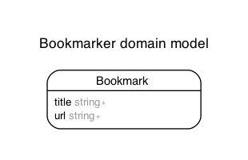

# Bookmarker

# Features

- Test Static Content
- Test basic CRUD feature
- Rspec
- Capybara (Browser Automation Tool)

# Model

Generated by Rails ERD. Run rails erd to regenerate (must have graphviz).

## Version

- ruby 3.1.2
- Rails 7.0.4
